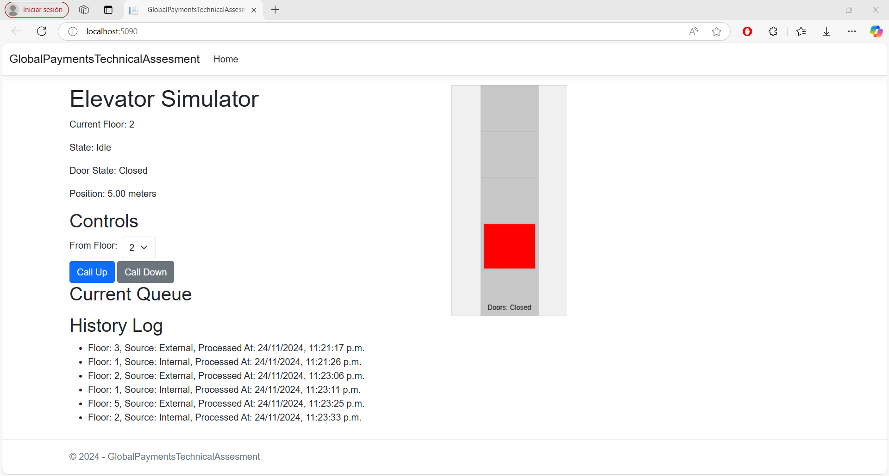
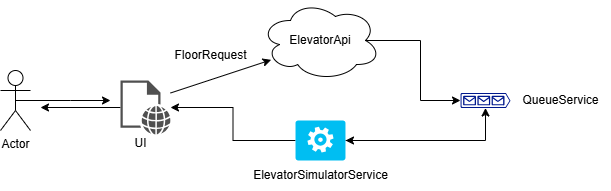

# Elevator Simulation Solution
This repository contains a robust elevator simulation system implemented in **ASP.NET Core**. 
It demonstrates a well-designed architecture with **object-oriented design patterns**, 
background task processing using **Hosted Services**, and **NUnit tests** for thorough validation  and **Processing.js** for visualization.



---

## Features

- **Elevator Request Queue**: Manages floor requests using a thread-safe `ConcurrentQueue`.
- **Background Processing**: Simulates elevator movement and processes requests asynchronously.
- **Object-Oriented Design**: Separates responsibilities using `QueueService`, `ElevatorService`, and API controllers.
- **UI with Polling**: Real-time updates of elevator state via an HTML page and Processing.js for visualization.
- **Unit Tests**: Comprehensive test coverage using NUnit.

---

## Architecture

Below is the architecture diagram for the solution:



### **Project Structure**

```
GlobalPaymentsTechnicalAssesment/
├── Controllers/
│   ├── ElevatorApiController.cs      # API Controller for elevator requests
│   ├── ElevatorSimulationController.cs # Main view controller
├── Models/
│   ├── FloorRequest.cs               # Represents a floor request
│   ├── ElevatorState.cs              # Represents the elevator's current state
│   ├── ProcessedRequest.cs           # Represents a logged request
├── Services/
│   ├── ElevatorService.cs            # Handles elevator logic
│   ├── QueueService.cs               # Manages request queue and history
├── Views/
│   ├── ElevatorSimulator/
│       ├── Index.cshtml              # Main UI
├── wwwroot/
│   ├── scripts.js                    # JavaScript for UI updates
├── Tests/
│   ├── ElevatorApiControllerTests.cs # Unit tests for the API
│   ├── ElevatorServiceTests.cs       # Unit tests for elevator logic
│   ├── QueueServiceTests.cs          # Unit tests for queue service
```

---

## Setup

### Prerequisites

1. .NET SDK 8.0 or higher.
2. Visual Studio 2022 (or any IDE supporting .NET Core).
3. Optional: Postman or cURL for testing the API.

### Getting Started

1. Clone the repository:
   ```bash
   git clone <repository-url>
   cd GlobalPaymentsTechnicalAssesment
   ```

2. Build and run the application:
   ```bash
   dotnet run
   ```

3. Open your browser and navigate to:
   - **UI**: [http://localhost:5000](http://localhost:5000)
   - **API Endpoints**: [http://localhost:5000/api/elevatorapi](http://localhost:5000/api/elevatorapi)

---

## API Endpoints

### **1. Add Floor Request**
- **Endpoint**: `POST /api/elevatorapi/request-floor`
- **Request Body**:
   ```json
   {
       "Source": "External",
       "Floor": 3
   }
   ```
- **Response**:
   ```json
   "Request added to queue."
   ```

### **2. Get Elevator State**
- **Endpoint**: `GET /api/elevatorapi/state`
- **Response**:
   ```json
   {
       "CurrentFloor": 3,
       "State": "Idle"
   }
   ```

---

## Testing

### Unit Tests

1. Navigate to the test project directory:
   ```bash
   cd GlobalPaymentsTechnicalAssesment.Tests
   ```

2. Run all tests:
   ```bash
   dotnet test
   ```
---

## Future Enhancements

- **Persistent Queue**: Integrate RabbitMQ or MSMQ for durable messaging.
- **Advanced State Handling**: Add features like optimize routing logic, door operations, emergency stops, etc.
- **Enhanced UI**: Provide better visuals for the elevator simulation.

---
